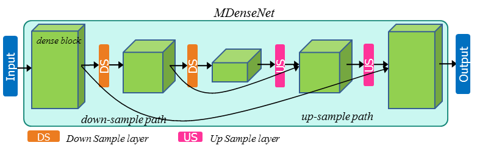
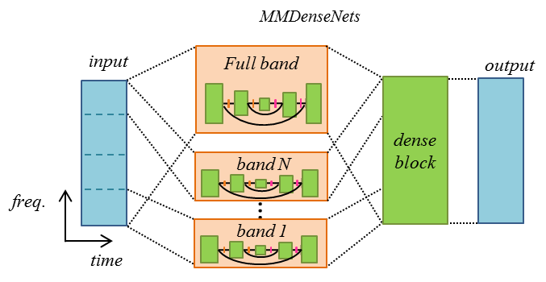

# TAK3
Naoya Takahashi¹, Nabarun Goswami², Yuki Mitsufuji¹

¹Sony Corporation, Audio Technology Development Department, Tokyo, Japan  
²Sony India Software Center, Bangalore, India

Naoya.Takahashi [at] sony.com

## Additional Info

* __is_blind:__ no
* __additional_training_data:__ yes

## Supplemental Material

* __Code:__ not available
* __Demos:__ not available

## Method

This submission uses a multi-scale multi-band DenseNets (MMDenseNet) as described in [1] with
maximum scale 5, 3 bands, maximum growth rate 15. For each instrument, a MMDenseNet is
trained to predict the target instrument amplitude from the mixture
amplitude in the STFT domain (frame size: 4096, hop size: 1024). The raw
output of each network is then combined by a multichannel Wiener filter as
described in [2] where we estimate the power spectral densities and spatial
covariance matrices from the DNN outputs.

We used the `train` part of `musdb` and an internal database with 804 songs as development set and randomly chose 48 songs as validation set, which is used to
perform early stopping and hyperparameter selection (growth rate,
number of layers).

  

## References
1. N. Takahashi and Y. Mitsufuji: Multi-scale multi-band DenseNets for audio source separation, Proc. WASPAA, 2017
2. A. A. Nugraha, A. Liutkus, and E. Vincent. "Multichannel music separation with deep neural networks." EUSIPCO, 2016.
